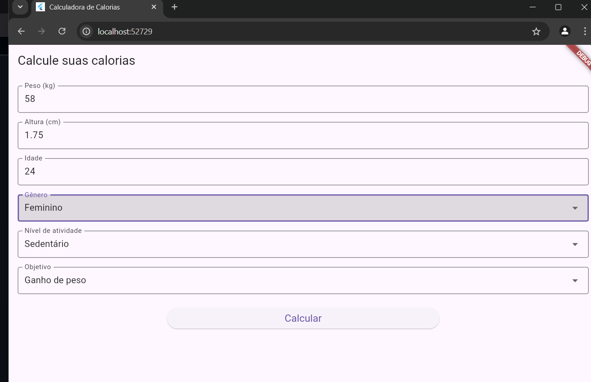
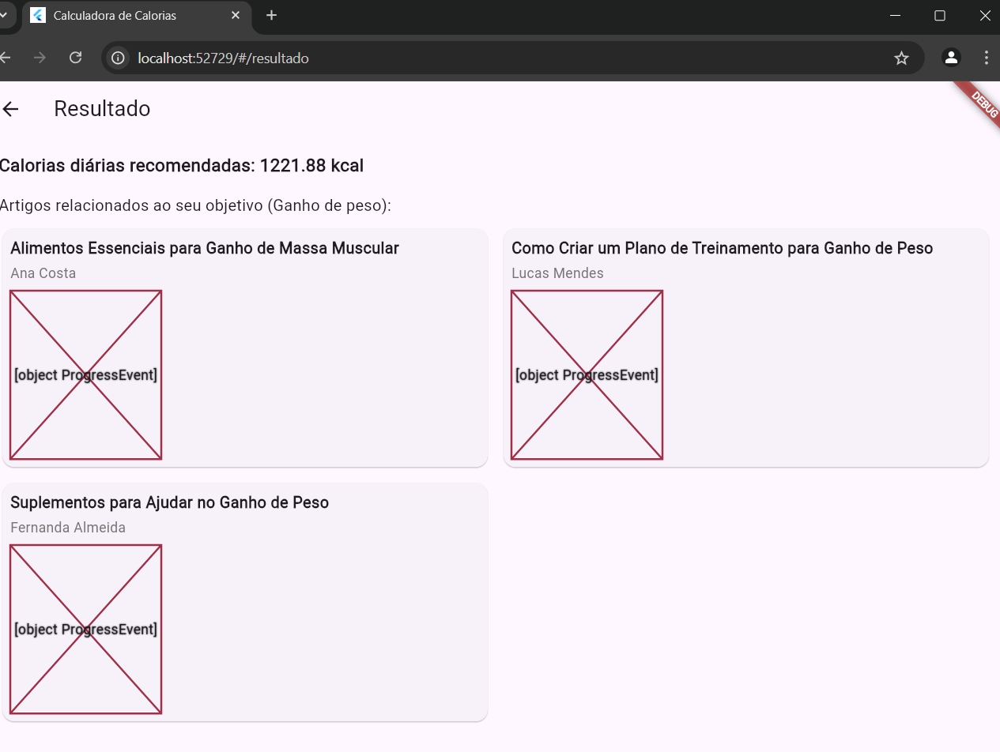
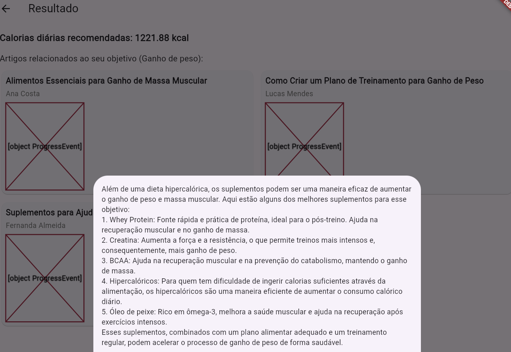

# Documentação do My Calorie App

## Visão Geral

Este documento fornece uma visão geral do My Calorie App, incluindo suas principais funcionalidades e como utilizá-las.

## Funcionalidades

- Cálculo da ingestão calórica diária
- Listagem de artigos
- Histórico de cálculos

## Como Usar o App

### 1. Tela Inicial

Na tela inicial, você verá opções para iniciar o cálculo ou acessar o histórico.

### 2. Tela de Cálculo

Insira seus dados pessoais, como peso, altura, idade e nível de atividade. Após inserir as informações, clique em "Calcular".

### 3. Tela de Artigos

Após calcular suas calorias, você verá uma lista de artigos que podem ajudar em seu objetivo de ganho ou perda de peso.

## Conclusão

Com o My Calorie App, você pode facilmente gerenciar sua dieta e encontrar recursos úteis para atingir suas metas de saúde.

